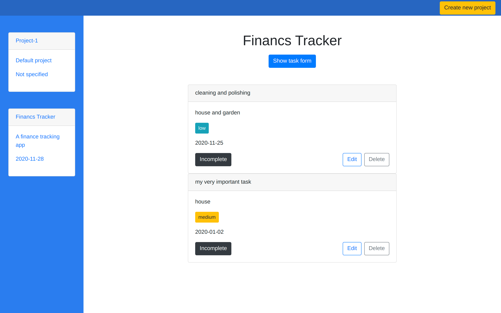

# Todo-list
A todo list app built with javascript

## Project Description
> Todo list app, where users can create new projects and add tasks inside projects. A task has a title, description,
 due date, priority, notes and completion status. 

> This app uses browsers localstorage to store data.

> The goal of this project was to get acquainted with the javascript data types, objects, constructors, classes, object oriented programming and functional programming, etc.

## Screenshot

## Built With

- HTML/CSS
- Javascript
- Webpack

## Live Demo

- [Todo App](https://rawcdn.githack.com/ershadul1/todo-list/c08dca5f1e1de53c07c3679eddaff10f9f09780a/dist/index.html)

## How to run this project on your local machine

### Prerequisites
1. An internet browser
1. npm
   
### Steps to follow
1. Clone the repository to your local machine using `git clone https://github.com/ershadul1/todo-list.git`
1. On your local machine, navigate to folder using `cd todo-list` in your terminal.
1. Run `npm install` for installing all the dependencies.
1. Navigate to dist folder.
1. Open the `index.html` with your preferred browser.

## Contributions

  There are two ways of contributing to this project:

1.  If you see something wrong or not working, please check [the issue tracker section](https://github.com/ershadul1/todo-list/issues), if that problem you met is not in already opened issues then open the issue by clicking on `new issue` button.

2.  If you have a solution to that, and you are willing to work on it, follow the below steps to contribute:
    1.  Fork this repository
    1.  Clone it on your local computer by running `git clone https://github.com/'user_name'/todo-list.git` __Replace *'user_name'* with the username you use on github__
    1.  Open the cloned repository which appears as a folder on your local computer with your favorite code editor
    1.  Create a separate branch off the *master branch*,
    1.  Write your codes which fix the issue you found
    1.  Commit and push the branch you created
    1.  Raise a pull request, comparing your new created branch with our original master branch [here](https://github.com/ershadul1/todo-list)

## Author 

👤 **Aldana**
​

- Github: [@AlduLonghi](https://github.com/AlduLonghi)

- Twitter: [@AbrilLonghi](https://twitter.com/AbrilLonghi)

- Linkedin: [Aldana Abril Longhi](https://www.linkedin.com/in/aldanalonghi/ )

👤 **Ershadul Rayhan**

- Github: [@ershadul1](https://github.com/ershadul1)
- Twitter: [@ErshadulRayhan](https://twitter.com/ErshadulRayhan)
- Linkedin: [ErshadulRayhan](https://www.linkedin.com/in/ershadulrayhan/)
- Email:  ershadul.rayhan@gmail.com

## Show your support

Give a ⭐️ if you like this project!

## Acknowledgments
- This project was inspired by the [Microverse](https:www.microverse.org) program